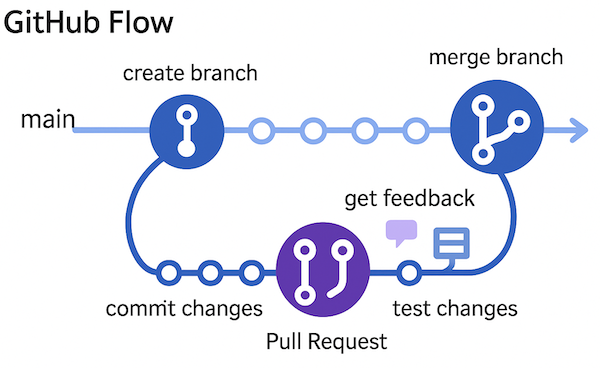

# Retningslinjer for utvikling av programvare

## Sikkerhet

Datatilsynet har utarbeidet gode retningslinjer for "Syv faser av programvareutvikling med innebygd personvern". Her finner du en [plakat som oppsummerer hvordan man bør jobbe helheltlig](https://www.datatilsynet.no/globalassets/global/dokumenter-pdfer-skjema-ol/regelverk/veiledere/innebygd-personvern/sikrel_plakat_web.pdf) for sikker utvikling. [OWASP](https://devguide.owasp.org/) er også en (ganske omstendig) ressurs som teamet ditt kan legge til grunn.

Automatisk scanning av kode kan være svært nyttig. GitHub tilbyr ulike varianter av dette, f.eks. dependency-sjekking (er det kjente sikkerhetshull i noen av bibliotekene du bruker) eller [code scanning](https://docs.github.com/en/code-security/code-scanning/introduction-to-code-scanning/about-code-scanning).

## Universell utforming

I UDE utvikler vi programvare m.h.p. universell utforming. Web Content Accessibility Guidelines, også kjent som [WCAG](https://www.uutilsynet.no/wcag-standarden/wcag-standarden/86) presiserer i detalj hva dette går ut på. Dersom du lager programvare for web, kan WAVE Evaluation Tool el.l. browser extension være nyttig for å identifisere UI-problemer.

## Konvesjoner for koding
Sørg for å følge kodestandardene til resten av teamet ditt. Sterk typing, eslint eller prettier kan gjøre livet ditt enklere.

## Prosjektstyring/boards

I noen prosjekter bruker vi GitHub Projects (boards) til å holde orden på status. Andre prosjekter bruker kanskje JIRA eller DevOps. Uansett: Husk å oppdatere issues ettersom hvor du er i prosessen.

## Feature (eller bugfix) livssyklus

Vi bruker Pull Requests og Code Reviews for å produsere god programvare, v.hj.a. en strategi som kalles [GitHub Flow](https://docs.github.com/en/get-started/using-github/github-flow).

  

### Her er slik vi jobber

1. Et tydelig mål

Før du begynner å kode, vær sikker på at du har en tydelig forstålse av formålet med featuren. Les deg opp på issues, eventuelle user stories, og nødvendig dokumentasjon.

2. Opprett en Feature Branch

Lag en ny branch i github for denne ene featuren du skal utivkle. Gi den et navn som andre kan forstå. Bugfiksing som retter opp kode som ligger i main, skal også gjøres i en egen branch. Med mindre det er helt krise og dette må fikses NÅ.

3. Commit og push

Før du publiserer noe kode ut på Internett, enten repository er public eller private, pass på at det ikke er noen personlige eller sensitive data med på lasset. Dette inkluderer passord, API-nøkler, logger, databasedumper, testdata osv.

Når du commiter og pusher til github, sørg for at hver commite gjør én ting og at meldingene som følger med commiten tydelig beskriver hva du har endret. Dersom du har en typo eller ser at du var uklar, husk at `git commit --amend -m"Oppdatert melding` er din venn.

4. Hyppig synkonisering med main

Pass på å merge main hyppig inn i din egen feature branch. Dette gjør at du holder deg oppdatert med hva andre driver med, samtidig som det reduserer sjansen for kode-konflikt når du etterhvert er ferdig.

5. Skriv tester

Skriv automatiserte tester og gi testene tydelige navn. Unit- eller API-tester fungerer både som dokumentasjon og sikkerhetsnett mot regress. Dessuten har testbar kode en tendens til å være enklere å vedlikeholde.

6. Code Reviews

Når feature branchen din er klar, lag en Pull Request og legg inn minst ett annet team-medlem som reviewer. Dette gir deg viktig feedback, luker ut bugs, holder andre utviklere orientert om hva du lager og sikrer at alle koder etter de samme konvensjonene.

NB: Du trenger naturligvis ikke å lage en PR for å be om feedback.

7. Godkjenning og merge

Når koden er godkjent og alle tester passerer, merger du branchen din inn i main.

8. Dokumentasjon

Koden du har skrevet bør størst mulig grad være selvdokumenterende, med gjennomtenkte navn på variable, funksjoner, klasser og filer. Dersom det trengs, husk å oppdatere README.md eller annen relevant dokumentasjon.

9. Release og release notes

Tag koden med versjon, om nødvendig. Deploy main branchen til produksjon. Husk å skrive release notes i relevant forum, dersom noen andre har interesse av endringen du har gjort. Forhåpentligvis er det noen som har det :)
